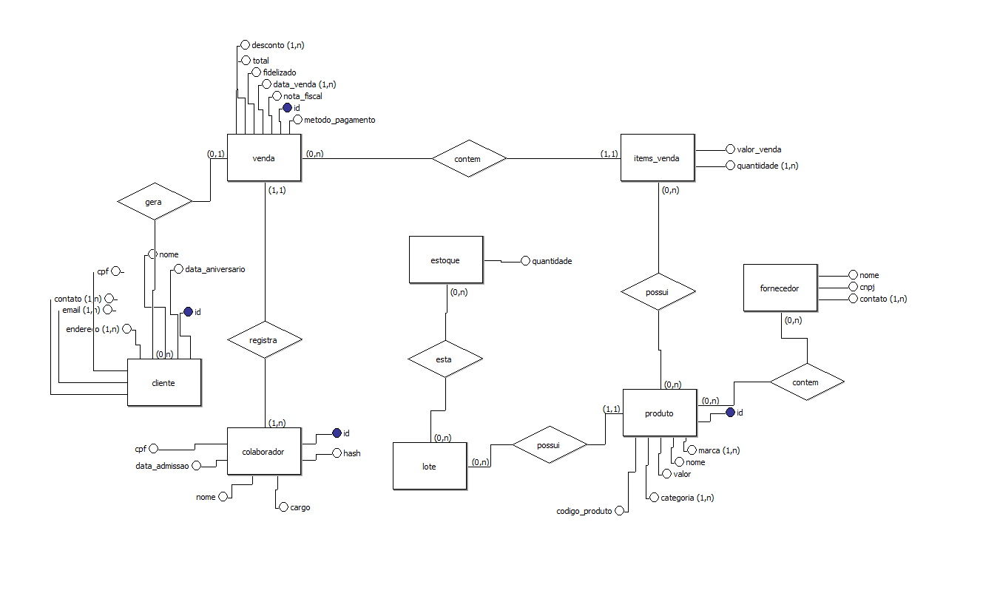
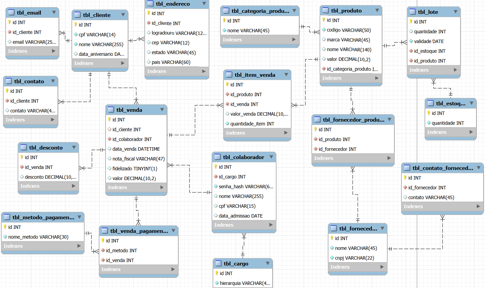
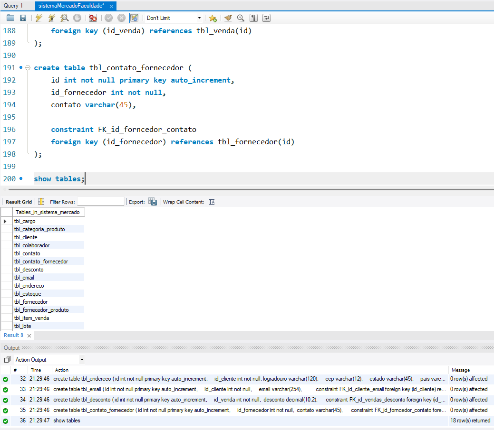

# Arquitetura de Banco de Dados: Sistema de Varejo

### Ojetivo do projeto

Modelagem e implementação de um banco de dados relacional em MySQL para um ambiente de supermercado.  
O foco desta arquitetura é garantir a integridade, possibilitar a auditoria de vendas por colaborador e fornecer dados estruturados para ações de marketing com foco na fidelização de clientes.

## **[Aqui está vídeo com a apresentação da modelagem](https://youtu.be/zW02oUcySv8?si=doddeyWNYHoHGymT)**

## Documentação das Camadas

### 1. Modelo Conceitual

O sistema foi desenhado para espelhar a operação real do varejo, contendo as seguintes entidades principais:

- **Colaboradores:** Quem opera o sistema.
- **Clientes:** O alvo da fidelização.
- **Produtos & Estoque:** O que está sendo transacionado.
- **Vendas:** O evento que conecta o Cliente, o Produto e o Colaborador.

  

### 2. Modelo Lógico

As regras de conexão aplicadas para garantir a integridade dos dados:

- Relacionamento **1:N** entre Colaborador e Vendas (Um colaborador faz várias vendas, garantindo a **auditoria**).
- Relacionamento **1:N** entre Cliente e Vendas e o Item da Venda (Garantindo histórico de compras).
- Tabela de **item_venda** (Relacionamento N:N entre Vendas e Produtos), contendo o "valor_venda" estático, garantindo o **congelamento de preço** histórico mesmo que o valor do produto mude na tabela principal.

  

### 3. Modelo Físico

- **SGBD:** MySQL
- **Arquivo:** O script completo de criação de tabelas (`CREATE TABLE`), e chaves estrangeiras (`FOREIGN KEY`) está disponível no arquivo `database_supermercado.sql` neste repositório.

  

---

### Foco em Segurança e Confiabilidade do Sistema

- **Rastreabilidade:** Cada registro financeiro está inevitavelmente atrelado ao ID de um operador em uma hierarquia de acesso.
- **Prevenção de Anomalias:** O uso de chaves estrangeiras impede a exclusão acidental de produtos que já constam em vendas passadas.
